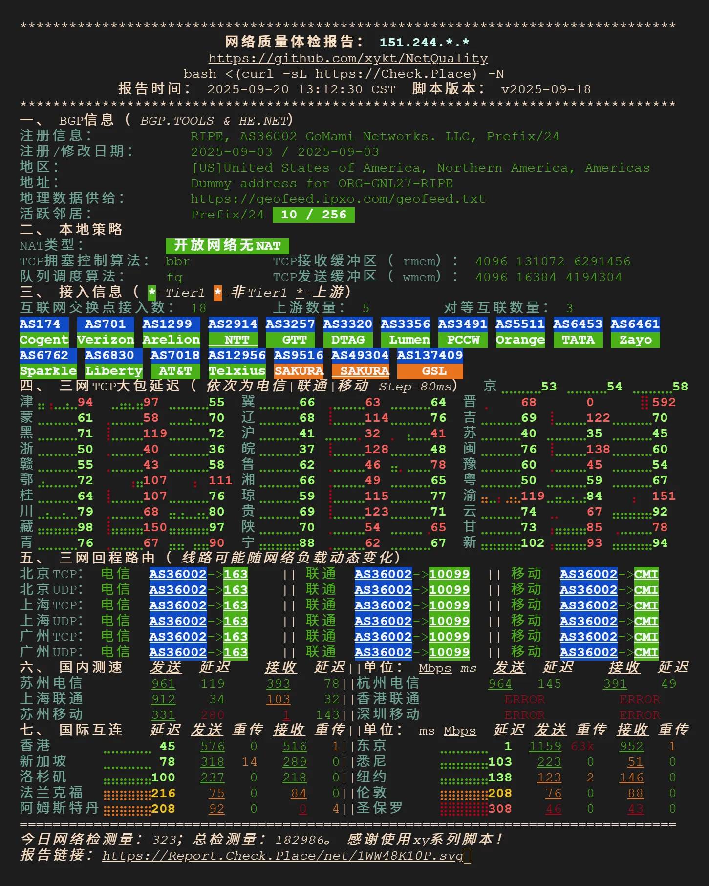
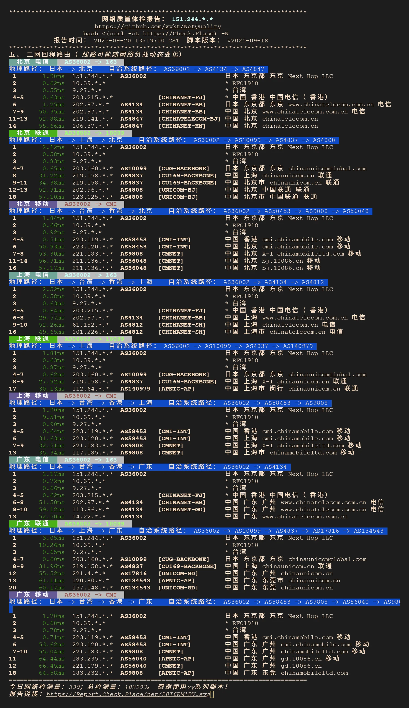

# 简介

[GoMami](https://gomami.io/aff.php?aff=160) 是 Sharon 的新站点。

🗻 GoMami Pulse 🇯🇵 为 Sharon JP-STD 同款路线。

但是与 Sharon 相比使用 AMD EPYC™ 7773X/7K83 ，强劲多核算力，稳定承载海量任务。
线路接入 163PP / 4837 / 58453 三重高保障，低延迟、高可靠。

因为 25 年初没有方法开通 TG 会员与 Sharon 机器失之交臂，同时在 DMIT 的 JP.PRO 跨网出现问题的现在首发购入了 GoMami-JPN.Pulse.Mini。

## 当前售卖套餐

| 型号 | CPU | 内存 | 硬盘 | 流量 | 带宽 | 附加功能 | 价格（月付） |
| :--- | :--- | :--- | :--- | :--- | :--- | :--- | :--- |
| JPN.Pulse.Mini | 2x vCPUs | 4GB | 40GB NVME SSD | 1000GB | 1Gbps | China Mainland Optimized Pro | $49.00 USD |
| JPN.Pulse.Air | 4x vCPUs | 8GB | 60GB NVME SSD | 2000GB | 1Gbps | China Mainland Optimized Pro | $89.00 USD |
| JPN.Pulse.Pro | 8x vCPUs | 16GB | 80GB NVME SSD | 5000GB | 3Gbps | Windows-ready, China Mainland Optimized Pro | $169.00 USD |

# 测试结果

## 💻基本信息

```
Basic System Information:
---------------------------------
Uptime     : 3 days, 7 hours, 25 minutes
Processor  : AMD EPYC 7773X 64-Core Processor
CPU cores  : 2 @ 2200.000 MHz
AES-NI     : ✔ Enabled
VM-x/AMD-V : ✔ Enabled
RAM        : 3.8 GiB
Swap       : 512.0 MiB
Disk       : 41.0 GiB
Distro     : Debian GNU/Linux 12 (bookworm)
Kernel     : 6.1.0-9-amd64
VM Type    : STANDARD PC (I440FX + PIIX, 1996)
IPv4/IPv6  : ✔ Online / ❌ Offline

IPv4 Network Information:
---------------------------------
ISP        : Next Hop LLC
ASN        : AS36002 Next Hop LLC
Host       : GoMami Networks. LLC
Location   : Shibuya City, Tokyo (13)
Country    : Japan

fio Disk Speed Tests (Mixed R/W 50/50) (Partition -):
---------------------------------
Block Size | 4k            (IOPS) | 64k           (IOPS)
  ------   | ---            ----  | ----           ---- 
Read       | 260.43 MB/s  (65.1k) | 2.42 GB/s    (37.8k)
Write      | 261.11 MB/s  (65.2k) | 2.43 GB/s    (38.0k)
Total      | 521.54 MB/s (130.3k) | 4.86 GB/s    (75.9k)
           |                      |                     
Block Size | 512k          (IOPS) | 1m            (IOPS)
  ------   | ---            ----  | ----           ---- 
Read       | 4.78 GB/s     (9.3k) | 4.52 GB/s     (4.4k)
Write      | 5.03 GB/s     (9.8k) | 4.82 GB/s     (4.7k)
Total      | 9.82 GB/s    (19.1k) | 9.34 GB/s     (9.1k)

Geekbench 5 Benchmark Test:
---------------------------------
Test            | Value                         
                |                               
Single Core     | 1206                          
Multi Core      | 2333                          
Full Test       | https://browser.geekbench.com/v5/cpu/23796642

 SysBench CPU 测试 (Fast Mode, 1-Pass @ 5sec)
---------------------------------
 1 线程测试(单核)得分:          3647 Scores
 2 线程测试(多核)得分:          7264 Scores
 SysBench 内存测试 (Fast Mode, 1-Pass @ 5sec)
---------------------------------
 单线程读测试:          43756.96 MB/s
 单线程写测试:          25967.65 MB/s
```

## 🎬IP质量

 

## 🌐网络质量

 

## 📍回程路由

 

# 总结

价格非常昂贵，同时也确实给力，考虑之后将对性能要求高的 Bot 迁移到此服务器上。

:::tip
计划协助迁移闪耀香橙汁至 Discord。
:::
